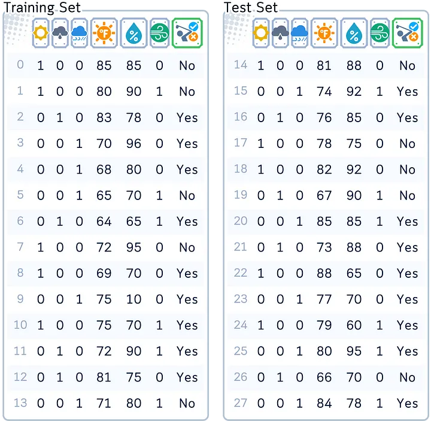

### AdaBoost Classifier, Explained: A Visual Guide with Code Examples
- Everyone makes mistakes — even the simplest decision trees in machine learning. Instead of ignoring them, AdaBoost (Adaptive Boosting) algorithm does something different: it learns (or adapts) from these mistakes to get better.

- Unlike Random Forest, which makes many trees at once, AdaBoost starts with a single, simple tree and identifies the instances it misclassifies. It then builds new trees to fix those errors, learning from its mistakes and getting better with each step.

- Here, we’ll illustrate exactly how AdaBoost makes its predictions, building strength by combining targeted weak learners just like a workout routine that turns focused exercises into full-body power.


- All visuals: Author-created using Canva Pro. Optimized for mobile; may appear oversized on desktop.
Definition
AdaBoost is an ensemble machine learning model that creates a sequence of weighted decision trees, typically using shallow trees (often just single-level “stumps”). Each tree is trained on the entire dataset, but with adaptive sample weights that give more importance to previously misclassified examples.

- For classification tasks, AdaBoost combines the trees through a weighted voting system, where better-performing trees get more influence in the final decision.

- The model’s strength comes from its adaptive learning process — while each simple tree might be a “weak learner” that performs only slightly better than random guessing, the weighted combination of trees creates a “strong learner” that progressively focuses on and corrects mistakes.


- AdaBoost is part of the boosting family of algorithms because it builds trees one at a time. Each new tree tries to fix the mistakes made by the previous trees. It then uses a weighted vote to combine their answers and make its final prediction.
Dataset Used
Throughout this article, we’ll focus on the classic golf dataset as an example for classification.


- Columns: ‘Outlook (one-hot-encoded into 3 columns)’, ’Temperature’ (in Fahrenheit), ‘Humidity’ (in %), ‘Windy’ (Yes/No) and ‘Play’ (Yes/No, target feature)
```python
import pandas as pd
import numpy as np
from sklearn.model_selection import train_test_split
# Create and prepare dataset

dataset_dict = {
    'Outlook': ['sunny', 'sunny', 'overcast', 'rainy', 'rainy', 'rainy', 'overcast', 
                'sunny', 'sunny', 'rainy', 'sunny', 'overcast', 'overcast', 'rainy',
                'sunny', 'overcast', 'rainy', 'sunny', 'sunny', 'rainy', 'overcast',
                'rainy', 'sunny', 'overcast', 'sunny', 'overcast', 'rainy', 'overcast'],
    'Temperature': [85.0, 80.0, 83.0, 70.0, 68.0, 65.0, 64.0, 72.0, 69.0, 75.0, 75.0,
                   72.0, 81.0, 71.0, 81.0, 74.0, 76.0, 78.0, 82.0, 67.0, 85.0, 73.0,
                   88.0, 77.0, 79.0, 80.0, 66.0, 84.0],
    'Humidity': [85.0, 90.0, 78.0, 96.0, 80.0, 70.0, 65.0, 95.0, 70.0, 80.0, 70.0,
                 90.0, 75.0, 80.0, 88.0, 92.0, 85.0, 75.0, 92.0, 90.0, 85.0, 88.0,
                 65.0, 70.0, 60.0, 95.0, 70.0, 78.0],
    'Wind': [False, True, False, False, False, True, True, False, False, False, True,
             True, False, True, True, False, False, True, False, True, True, False,
             True, False, False, True, False, False],
    'Play': ['No', 'No', 'Yes', 'Yes', 'Yes', 'No', 'Yes', 'No', 'Yes', 'Yes', 'Yes',
             'Yes', 'Yes', 'No', 'No', 'Yes', 'Yes', 'No', 'No', 'No', 'Yes', 'Yes',
             'Yes', 'Yes', 'Yes', 'Yes', 'No', 'Yes']
}
```
# Prepare data
```python
df = pd.DataFrame(dataset_dict)
df = pd.DataFrame(dataset_dict)
df = pd.get_dummies(df, columns=['Outlook'], prefix='', prefix_sep='', dtype=int)
df['Wind'] = df['Wind'].astype(int)
df['Play'] = (df['Play'] == 'Yes').astype(int)

# Rearrange columns
column_order = ['sunny', 'overcast', 'rainy', 'Temperature', 'Humidity', 'Wind', 'Play']
df = df[column_order]

# Prepare features and target
X,y = df.drop('Play', axis=1), df['Play']
X_train, X_test, y_train, y_test = train_test_split(X, y, train_size=0.5, shuffle=False)Main Mechanism
```
# Main Mechanism
Here’s how AdaBoost works:

- Initialize Weights: Assign equal weight to each training example.
Iterative Learning: In each step, a simple decision tree is trained and its performance is checked. Misclassified examples get more weight, making them a priority for the next tree. Correctly classified examples stay the same, and all weights are adjusted to add up to 1.
Build Weak Learners: Each new, simple tree targets the mistakes of the previous ones, creating a sequence of specialized weak learners.
Final Prediction: Combine all trees through weighted voting, where each tree’s vote is based on its importance value, giving more influence to more accurate trees.

- An AdaBoost Classifier makes predictions by using many simple decision trees (usually 50–100). Each tree, called a “stump,” focuses on one important feature, like temperature or humidity. The final prediction is made by combining all the trees’ votes, each weighted by how important that tree is (“alpha”).
Training Steps
Here, we’ll follow the SAMME (Stagewise Additive Modeling using a Multi-class Exponential loss function) algorithm, the standard approach in scikit-learn that handles both binary and multi-class classification.

1.1. Decide the weak learner to be used. A one-level decision tree (or “stump”) is the default choice.
1.2. Decide how many weak learner (in this case the number of trees) you want to build (the default is 50 trees).


- We begin with depth-1 decision trees (stumps) as our weak learners. Each stump makes just one split, and we’ll train 50 of them sequentially, adjusting weights along the way.
1.3. Start by giving each training example equal weight:
· Each sample gets weight = 1/N (N is total number of samples)
· All weights together sum to 1


- All data points start with equal weights (0.0714), with the total weight adding up to 1. This ensures every example is equally important when training begins.
For the First Tree
2.1. Build a decision stump while considering sample weights


- Before making the first split, the algorithm examines all data points with their weights to find the best splitting point. These weights influence how important each example is in making the split decision.
a. Calculate initial weighted Gini impurity for the root node


- The algorithm calculates the Gini impurity score at the root node, but now considers the weights of all data points.
b. For each feature:
· Sort data by feature values (exactly like in Decision Tree classifier)


- For each feature, the algorithm sorts the data and identifies potential split points, exactly like the standard Decision Tree.
· For each possible split point:
·· Split samples into left and right groups
·· Calculate weighted Gini impurity for both groups
·· Calculate weighted Gini impurity reduction for this split


- The algorithm calculates weighted Gini impurity for each potential split and compares it to the parent node. For feature “sunny” with split point 0.5, this impurity reduction (0.066) shows how much this split improves the data separation.
c. Pick the split that gives the largest Gini impurity reduction


- After checking all possible splits across features, the column ‘overcast’ (with split point 0.5) gives the highest impurity reduction of 0.102. This means it’s the most effective way to separate the classes, making it the best choice for the first split.
d. Create a simple one-split tree using this decision


- Using the best split point found, the algorithm divides the data into two groups, each keeping their original weights. This simple decision tree is purposely kept small and imperfect, making it just slightly better than random guessing.

2.2. Evaluate how good this tree is
a. Use the tree to predict the label of the training set.
b. Add up the weights of all misclassified samples to get error rate


- The first weak learner makes predictions on the training data, and we check where it made mistakes (marked with X). The error rate of 0.357 shows this simple tree gets some predictions wrong, which is expected and will help guide the next steps of training.

c. Calculate tree importance (α) using:
α = learning_rate × log((1-error)/error)


- Using the error rate, we calculate the tree’s influence score (α = 0.5878). Higher scores mean more accurate trees, and this tree earned moderate importance for its decent performance.

2.3. Update sample weights
a. Keep the original weights for correctly classified samples
b. Multiply the weights of misclassified samples by e^(α).
c. Divide each weight by the sum of all weights. This normalization ensures all weights still sum to 1 while maintaining their relative proportions.


- Cases where the tree made mistakes (marked with X) get higher weights for the next round. After increasing these weights, all weights are normalized to sum to 1, ensuring misclassified examples get more attention in the next tree.
For the Second Tree
2.1. Build a new stump, but now using the updated weights
a. Calculate new weighted Gini impurity for root node:
· Will be different because misclassified samples now have bigger weights
· Correctly classified samples now have smaller weights


- Using the updated weights (where misclassified examples now have higher importance), the algorithm calculates the weighted Gini impurity at the root node. This begins the process of building the second decision tree.
b. For each feature:
· Same process as before, but the weights have changed
c. Pick the split with best weighted Gini impurity reduction
· Often completely different from the first tree’s split
· Focuses on samples the first tree got wrong


- With updated weights, different split points show different effectiveness. Notice that “overcast” is no longer the best split — the algorithm now finds temperature (84.0) gives the highest impurity reduction, showing how weight changes affect split selection.
d. Create the second stump


- Using temperature ≤ 84.0 as the split point, the algorithm assigns YES/NO to each leaf based on which class has more total weight in that group, not just by counting examples. This weighted voting helps correct the previous tree’s mistakes.
2.2. Evaluate this new tree
a. Calculate error rate with current weights
b. Calculate its importance (α) using the same formula as before
2.3. Update weights again — Same process: increase weights for mistakes then normalize.


- The second tree achieves a lower error rate (0.222) and higher importance score (α = 1.253) than the first tree. Like before, misclassified examples get higher weights for the next round.
For the Third Tree onwards
Repeat Step 2.1–2.3 for all remaining trees.


- The algorithm builds 50 simple decision trees sequentially, each with its own importance score (α). Each tree learns from previous mistakes by focusing on different aspects of the data, creating a strong combined model. Notice how some trees (like Tree 2) get higher importance scores when they perform better.
Step 3: Final Ensemble
3.1. Keep all trees and their importance scores


- The 50 simple decision trees work together as a team, each with its own importance score (α). When making predictions, trees with higher α values (like Tree 2 with 1.253) have more influence on the final decision than trees with lower scores.
from sklearn.tree import plot_tree
from sklearn.ensemble import AdaBoostClassifier
from sklearn.tree import plot_tree
import matplotlib.pyplot as plt

# Train AdaBoost
np.random.seed(42)  # For reproducibility
clf = AdaBoostClassifier(algorithm='SAMME', n_estimators=50, random_state=42)
clf.fit(X_train, y_train)

# Create visualizations for trees 1, 2, and 50
trees_to_show = [0, 1, 49]
feature_names = X_train.columns.tolist()
class_names = ['No', 'Yes']

# Set up the plot
fig, axes = plt.subplots(1, 3, figsize=(14,4), dpi=300)
fig.suptitle('Decision Stumps from AdaBoost', fontsize=16)

# Plot each tree
```python
for idx, tree_idx in enumerate(trees_to_show):
    plot_tree(clf.estimators_[tree_idx],
              feature_names=feature_names,
              class_names=class_names,
              filled=True,
              rounded=True,
              ax=axes[idx],
              fontsize=12)  # Increased font size
    axes[idx].set_title(f'Tree {tree_idx + 1}', fontsize=12)

plt.tight_layout(rect=[0, 0.03, 1, 0.95])
```
- Each node shows its ‘value’ parameter as [weight_NO, weight_YES], which represents the weighted proportion of each class at that node. These weights come from the sample weights we calculated during training.

Testing Step
- For predicting:
a. Get each tree’s prediction
b. Multiply each by its importance score (α)
c. Add them all up
d. The class with higher total weight will be the final prediction


- When predicting for new data, each tree makes its prediction and multiplies it by its importance score (α). The final decision comes from adding up all weighted votes — here, the NO class gets a higher total score (23.315 vs 15.440), so the model predicts NO for this unseen example.
Evaluation Step
After building all the trees, we can evaluate the test set.


- By iteratively training and weighting weak learners to focus on misclassified examples, AdaBoost creates a strong classifier that achieves high accuracy — typically better than single decision trees or simpler models!
```python
# Get predictions
y_pred = clf.predict(X_test)

# Create DataFrame with actual and predicted values
results_df = pd.DataFrame({
    'Actual': y_test,
    'Predicted': y_pred
})
print(results_df) # Display results DataFrame

# Calculate and display accuracy
from sklearn.metrics import accuracy_score
accuracy = accuracy_score(y_test, y_pred)
print(f"\nModel Accuracy: {accuracy:.4f}")
```
Key Parameters
Here are the key parameters for AdaBoost, particularly in scikit-learn:

- estimator: This is the base model that AdaBoost uses to build its final solution. The 3 most common weak learners are:
- a. Decision Tree with depth 1 (Decision Stump): This is the default and most popular choice. Because it only has one split, it is considered a very weak learner that is just a bit better than random guessing, exactly what is needed for boosting process.
- b. Logistic Regression: Logistic regression (especially with high-penalty) can also be used here even though it is not really a weak learner. It could be useful for data that has linear relationship.
- c. Decision Trees with small depth (e.g., depth 2 or 3): These are slightly more complex than decision stumps. They’re still fairly simple, but can handle slightly more complex patterns than the decision stump.


- AdaBoost’s base models can be simple decision stumps (depth=1), small trees (depth 2–3), or penalized linear models. Each type is kept simple to avoid overfitting while offering different ways to capture patterns.
n_estimators: The number of weak learners to combine, typically around 50–100. Using more than 100 rarely helps.

- learning_rate: Controls how much each classifier affects the final result. Common starting values are 0.1, 0.5, or 1.0. Lower numbers (like 0.1) and a bit higher n_estimator usually work better.

## Key differences from Random Forest
As both Random Forest and AdaBoost works with multiple trees, it is easy to confuse the parameters involved. The key difference is that Random Forest combines many trees independently (bagging) while AdaBoost builds trees one after another to fix mistakes (boosting). Here are some other details about their differences:

- No bootstrap parameter because AdaBoost uses all data but with changing weights
No oob_score because AdaBoost doesn't use bootstrap sampling
learning_rate becomes crucial (not present in Random Forest)
Tree depth is typically kept very shallow (usually just stumps) unlike Random Forest’s deeper trees
The focus shifts from parallel independent trees to sequential dependent trees, making parameters like n_jobs less relevant
Pros & Cons
# Pros:
Adaptive Learning: AdaBoost gets better by giving more weight to mistakes it made. Each new tree pays more attention to the hard cases it got wrong.
Resists Overfitting: Even though it keeps adding more trees one by one, AdaBoost usually doesn’t get too focused on training data. This is because it uses weighted voting, so no single tree can control the final answer too much.
Built-in Feature Selection: AdaBoost naturally finds which features matter most. Each simple tree picks the most useful feature for that round, which means it automatically selects important features as it trains.
# Cons:
Sensitive to Noise: Because it gives more weight to mistakes, AdaBoost can have trouble with messy or wrong data. If some training examples have wrong labels, it might focus too much on these bad examples, making the whole model worse.
Must Be Sequential: Unlike Random Forest which can train many trees at once, AdaBoost must train one tree at a time because each new tree needs to know how the previous trees did. This makes it slower to train.
Learning Rate Sensitivity: While it has fewer settings to tune than Random Forest, the learning rate really affects how well it works. If it’s too high, it might learn the training data too exactly. If it’s too low, it needs many more trees to work well.
Final Remarks
- AdaBoost is a key boosting algorithm that many newer methods learned from. Its main idea — getting better by focusing on mistakes — has helped shape many modern machine learning tools. While other methods try to be perfect from the start, AdaBoost tries to show that sometimes the best way to solve a problem is to learn from your errors and keep improving.

- AdaBoost also works best in binary classification problems and when your data is clean. While Random Forest might be better for more general tasks (like predicting numbers) or messy data, AdaBoost can give really good results when used in the right way. The fact that people still use it after so many years shows just how well the core idea works!

🌟 AdaBoost Classifier Code Summarized

```python
import pandas as pd
import numpy as np
from sklearn.model_selection import train_test_split
from sklearn.metrics import accuracy_score
from sklearn.ensemble import AdaBoostClassifier
from sklearn.tree import DecisionTreeClassifier

# Create dataset
dataset_dict = {
    'Outlook': ['sunny', 'sunny', 'overcast', 'rainy', 'rainy', 'rainy', 'overcast', 
                'sunny', 'sunny', 'rainy', 'sunny', 'overcast', 'overcast', 'rainy',
                'sunny', 'overcast', 'rainy', 'sunny', 'sunny', 'rainy', 'overcast',
                'rainy', 'sunny', 'overcast', 'sunny', 'overcast', 'rainy', 'overcast'],
    'Temperature': [85.0, 80.0, 83.0, 70.0, 68.0, 65.0, 64.0, 72.0, 69.0, 75.0, 75.0,
                   72.0, 81.0, 71.0, 81.0, 74.0, 76.0, 78.0, 82.0, 67.0, 85.0, 73.0,
                   88.0, 77.0, 79.0, 80.0, 66.0, 84.0],
    'Humidity': [85.0, 90.0, 78.0, 96.0, 80.0, 70.0, 65.0, 95.0, 70.0, 80.0, 70.0,
                 90.0, 75.0, 80.0, 88.0, 92.0, 85.0, 75.0, 92.0, 90.0, 85.0, 88.0,
                 65.0, 70.0, 60.0, 95.0, 70.0, 78.0],
    'Wind': [False, True, False, False, False, True, True, False, False, False, True,
             True, False, True, True, False, False, True, False, True, True, False,
             True, False, False, True, False, False],
    'Play': ['No', 'No', 'Yes', 'Yes', 'Yes', 'No', 'Yes', 'No', 'Yes', 'Yes', 'Yes',
             'Yes', 'Yes', 'No', 'No', 'Yes', 'Yes', 'No', 'No', 'No', 'Yes', 'Yes',
             'Yes', 'Yes', 'Yes', 'Yes', 'No', 'Yes']
}
df = pd.DataFrame(dataset_dict)

# Prepare data
df = pd.get_dummies(df, columns=['Outlook'], prefix='', prefix_sep='', dtype=int)
df['Wind'] = df['Wind'].astype(int)
df['Play'] = (df['Play'] == 'Yes').astype(int)

# Split features and target
X, y = df.drop('Play', axis=1), df['Play']
X_train, X_test, y_train, y_test = train_test_split(X, y, train_size=0.5, shuffle=False)

# Train AdaBoost
ada = AdaBoostClassifier(
    estimator=DecisionTreeClassifier(max_depth=1), # Create base estimator (decision stump)
    n_estimators=50,        # Typically fewer trees than Random Forest
    learning_rate=1.0,      # Default learning rate
    algorithm='SAMME',      # The only currently available algorithm (will be removed in future scikit-learn updates)
    random_state=42
)
ada.fit(X_train, y_train)

# Predict and evaluate
y_pred = ada.predict(X_test)
print(f"Accuracy: {accuracy_score(y_test, y_pred)}")
```
## Further Reading
For a detailed explanation of the AdaBoostClassifier and its implementation in scikit-learn, readers can refer to the official documentation, which provides comprehensive information on its usage and parameters.

## Technical Environment
This article uses Python 3.7 and scikit-learn 1.6. While the concepts discussed are generally applicable, specific code implementations may vary slightly with different versions.

## About the Illustrations
Unless otherwise noted, all images are created by the author, incorporating licensed design elements from Canva Pro.