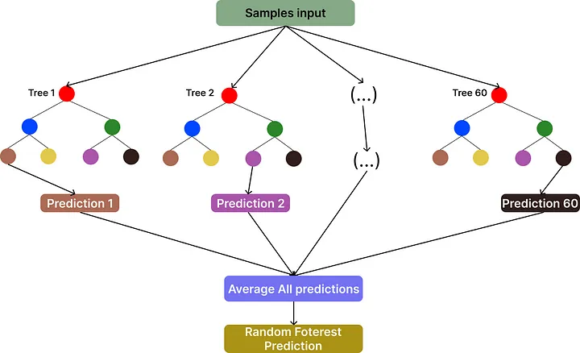
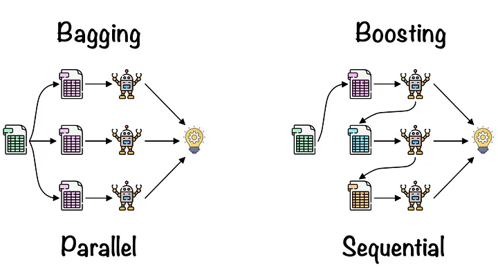
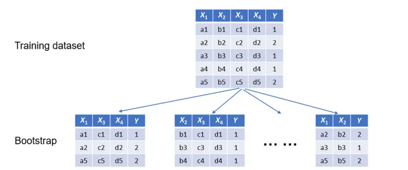
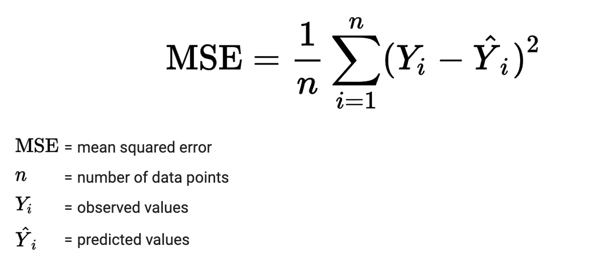
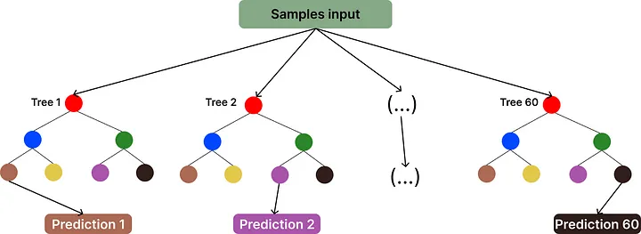

### What is Random Forest Algorithm?
- Random Forest is a machine learning algorithm that belongs to the ensemble learning category, constructed upon the foundation of decision trees. Ensemble learning involves combining the predictions of multiple models to improve overall performance and robustness. Random Forest is particularly powerful for both classification and regression tasks.

- In the Random Forest technique, individual instances are carefully considered, and each decision tree casts its vote on the classification of the input data. The final prediction is determined by selecting the classification that receives the majority of votes from the ensemble of decision trees. This democratic and collaborative approach enhances the algorithm’s robustness and accuracy in making predictions, making it a versatile tool for a wide range of applications in machine learning and data analysis.

- Each tree in the Random Forest classification process takes input from samples within the initial dataset. The uniqueness of this algorithm lies in the random selection of features, which are utilized in the growth of each tree at every node. Notably, no tree in the forest undergoes pruning until the conclusion of the entire process, specifically when a decisive prediction is reached.

- This methodology ensures that each tree contributes its insights without premature pruning, allowing for a comprehensive exploration of the feature space. By doing so, the Random Forest effectively harnesses the diverse perspectives of individual trees, enabling the aggregation of weak classifiers into a robust and powerful classifier. This distinctive feature of the Random Forest algorithm facilitates the creation of a strong classifier even when the individual classifiers exhibit weak correlations.
### Ensemble Algorithms: Bagging vs Boosting

## Bagging (Bootstrap Aggregating)
Bagging is a widely utilized ensemble learning technique designed to mitigate variance and prevent overfitting in predictive models. The following key characteristics define the Bagging process:

- 1.1 Data Subset Creation: Bagging involves the creation of multiple subsets from the training dataset through the process of randomly sampling with replacement, a technique known as bootstrap sampling.

- 1.2 Individual Model Training: Each generated subset serves as the training data for a distinct base model, often a decision tree. This step introduces diversity among the models.

- 1.3 Aggregation of Predictions: The final prediction is computed by aggregating the individual model predictions. For regression tasks, this typically involves averaging, while for classification tasks, a majority vote is employed

## Boosting
Boosting is another powerful ensemble learning technique aimed at refining the accuracy of predictive models. The Boosting process is characterized by the following key elements:

- 2.1 Sequential Model Building: Boosting constructs a sequence of weak learners sequentially. Each subsequent model in the sequence aims to correct errors made by its predecessors, gradually improving overall accuracy.

- 2.2 Common Boosting Algorithms: Prominent boosting algorithms include AdaBoost, Gradient Boosting (e.g., XGBoost, LightGBM, and CatBoost), among others. These algorithms contribute to the iterative refinement process.

- 2.3 Weight Assignment: Boosting introduces the concept of assigning weights to instances in the dataset. Instances that are misclassified by previous models receive higher weights, ensuring a focus on correcting these errors in subsequent models.

Steps involved in Random Forest Algorithm
## 1. Bootstrap sampling
Bagging (Bootstrap Aggregation) is a Machine Learning Ensemble algorithm, essentially a collection of decision tree models, although it supports other techniques for combining models. It is based on the concept of bootstrap sampling, which involves sampling with replacement from a dataset (allowing a sample to be chosen again in another iteration).

Formally, bagging follows this approach, where multiple bootstrap samples are drawn from the training dataset, and a decision tree model is fitted to each of them. The predictions from the decision trees are then combined, typically resulting in a combined model with higher accuracy and robustness.

Decision trees are employed because they tend to exhibit “overfitting” to the data on which they are trained, characterized by models with high variance. In theory, each tree adapts to the dataset it is given, allowing each tree to capture specific nuances based on the data’s characteristics. The effectiveness of the bagging method relies on the assumption that the trees have low correlation among their predictions, thereby resulting in reduced errors in the combined prediction. The bagging technique is particularly suitable for models with high variance.

## 2. Building Decision Trees
- The construction of a decision tree involves selecting the best attributes for division at each node. The impurity of a node can be measured using the Gini criterion (for classification) or mean squared error (for regression).

- Gini Impurity: metric to decide the optimal split from a root node, and subsequent splits. It is the most popular and the easiest way to split a decision tree and it works only with categorical targets as it only does binary splits. Lower the Gini Impurity, higher is the homogeneity of the node. The Gini Impurity of a pure node(same class) is zero.

where pi​ represents the fraction of instances belonging to class i within the node, and c denotes the total number of classes.

Erro Quadrático Médio (MSE):

## 3. Independent Decision Tree Predictions
Each tree independently makes predictions for the input data. For classification problems, this could be a class label, and for regression problems, it could be a numerical value.

# 4. Combining Predictions
The final prediction of the Random Forest is then determined based on combining the outputs of all individual trees. For classification, it could involve a majority vote, and for regression, it might be an average of the predictions.
